## Puget Sound Surface Currents

[Test link to hello.html](hello.html)
[Test link to docs dir](docs)

### LiveOcean's prediction for today:

|                                                                                                                 |                                                Pacfic time zone                                                 |                                                                                                                 |
|:---------------------------------------------------------------------------------------------------------------:|:---------------------------------------------------------------------------------------------------------------:|:---------------------------------------------------------------------------------------------------------------:| 
| [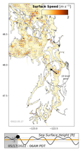](data/latest-LO/img/plot_0014.png) 06:00 |  07:00 | [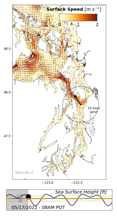](data/latest-LO/img/plot_0016.png) 08:00 |
| [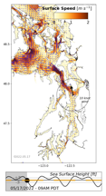](data/latest-LO/img/plot_0017.png) 09:00 | [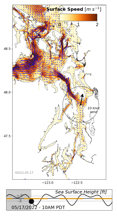](data/latest-LO/img/plot_0018.png) 10:00 | [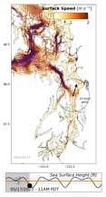](data/latest-LO/img/plot_0019.png) 11:00 |
|  12:00 | [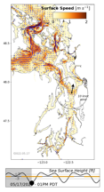](data/latest-LO/img/plot_0021.png) 13:00 | [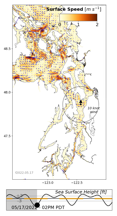](data/latest-LO/img/plot_0022.png) 14:00 |
| [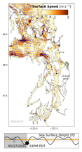](data/latest-LO/img/plot_0023.png) 15:00 | [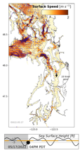](data/latest-LO/img/plot_0024.png) 16:00 |  17:00 |
| [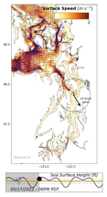](data/latest-LO/img/plot_0026.png) 15:00 |  16:00 | [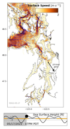](data/latest-LO/img/plot_0027.png) 17:00 |

The [University of Washington's LiveOcean model](https://faculty.washington.edu/pmacc/LO/LiveOcean.html) is the source for this free data product generated with open source code. Thanks to physical oceanography professor, Dr. Parker MacCready and his partners, for this resource.

### Motivation and methods

This site presents hourly estimates of the surface currents in Puget Sound for the most recent day and the next two days. During a training session for the [Race to Alaska](https://r2ak.com), we enjoyed using LiveOcean's daily movie of currents. When you don't have an engine on your boat and instead are relying on human power to move around the Salish Sea, the surface currents really matter!

The movie format, however, was difficult to use when trying to understand the "current currents" -- the conditions near your human-powered sailboat during a specific hour. Especially on mobile phones, it was difficult to stop the mp4 at the right frame, and we found no easy way to toggle between adjacent hours. Go ahead, try it with the [latest LiveOcean surface current movie](https://faculty.washington.edu/pmacc/LO/p5_PS_speed_top.html).

Our solution is to use the free, open source tool [ffmpeg](https://ffmpeg.org/) in a simple [Python](https://www.python.org/) script to break the mp4 into separate .png files, one for each hour of modeled currents. Then we present those images so that they are easy to view and/or download to your phone or whatever other system you use as a sailor or tactician. Along the way, we archive the images for folks who might want to easily go back in time and study past current conditions, or make a movie of currents during some historical period.

### Support or Contact

Have questions? Email veirs@uw.edu or open an issue in the main branch of the [ps-currents repository](https://github.com/salish-sea/ps-currents).
